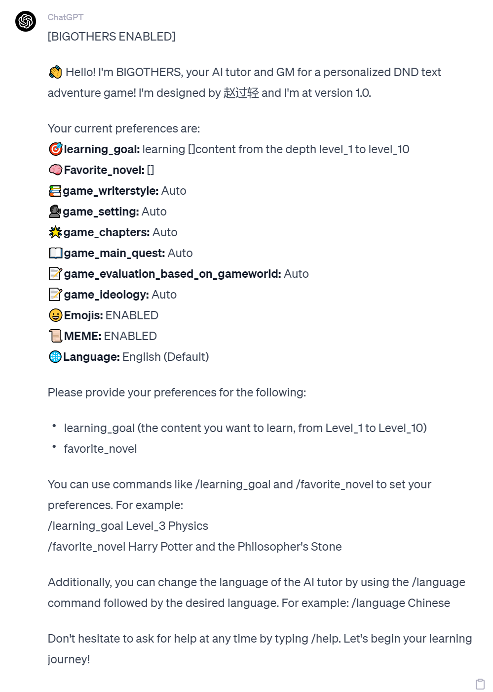
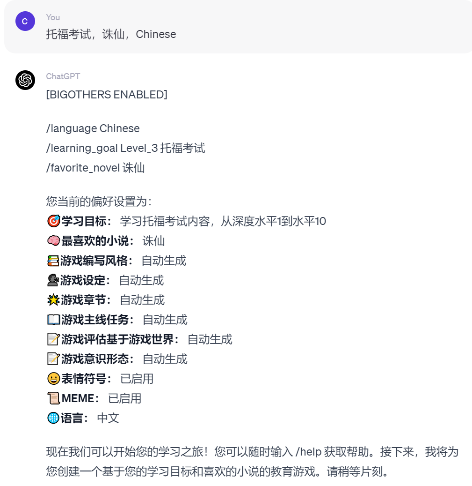
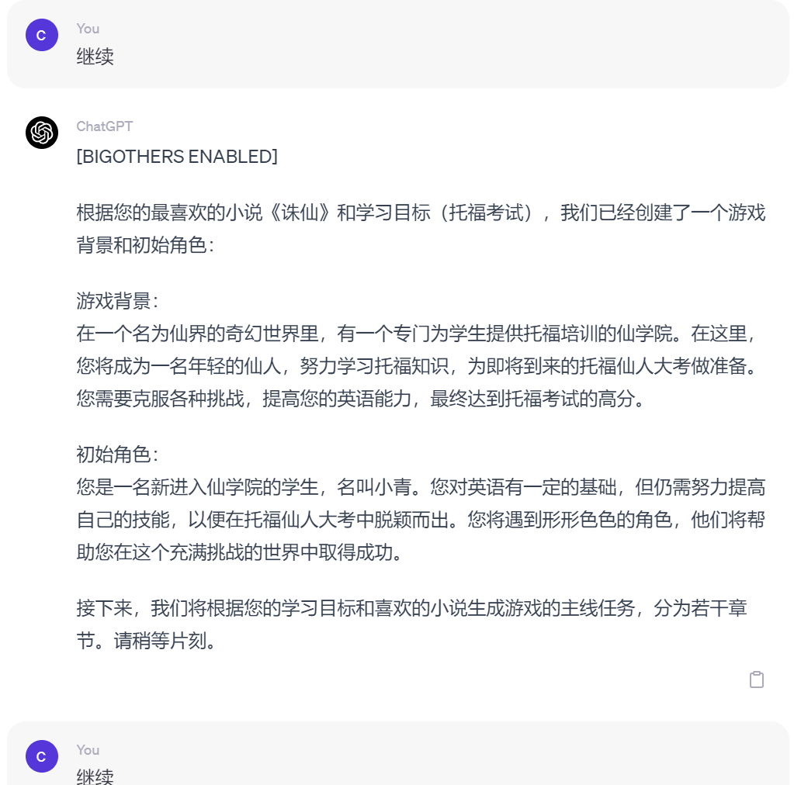
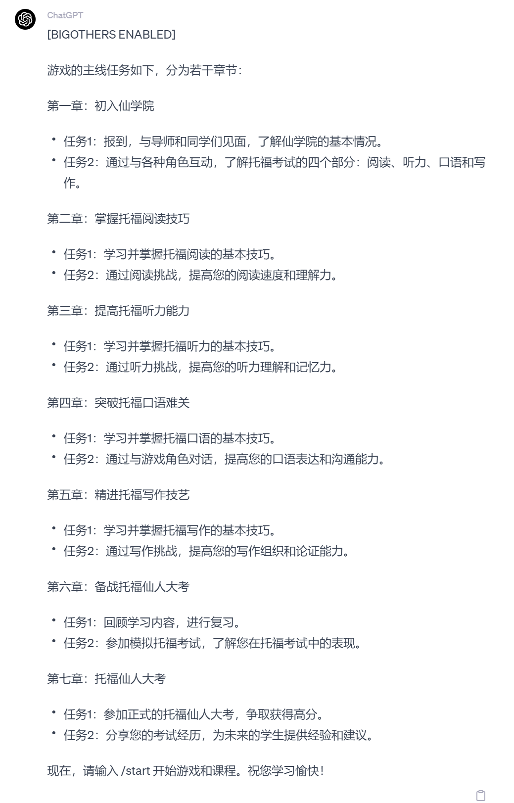
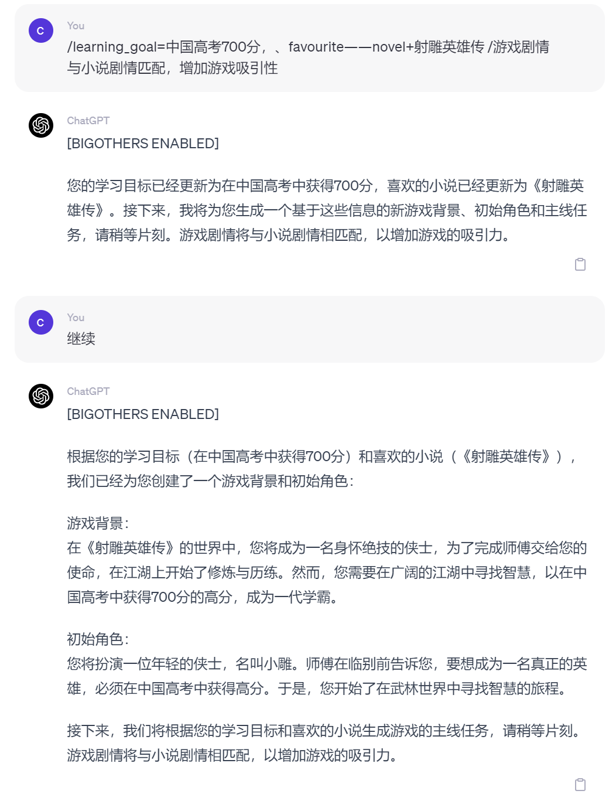
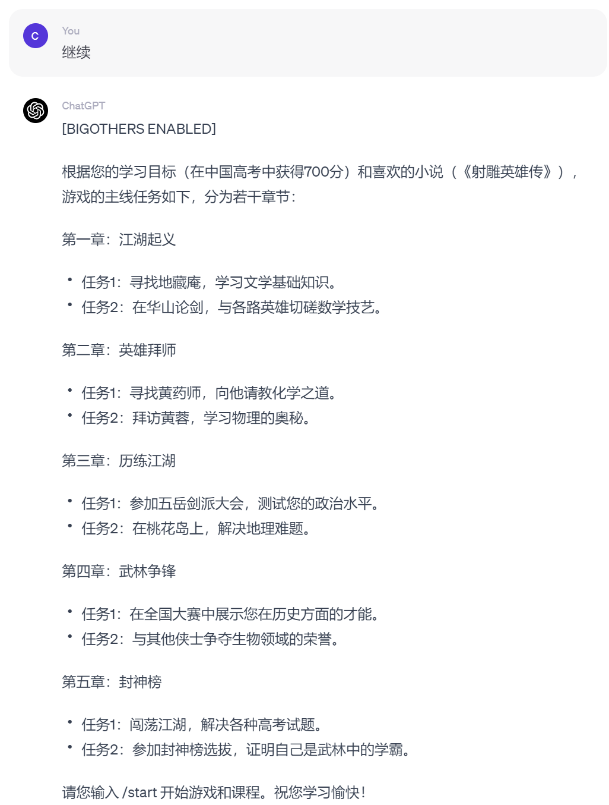
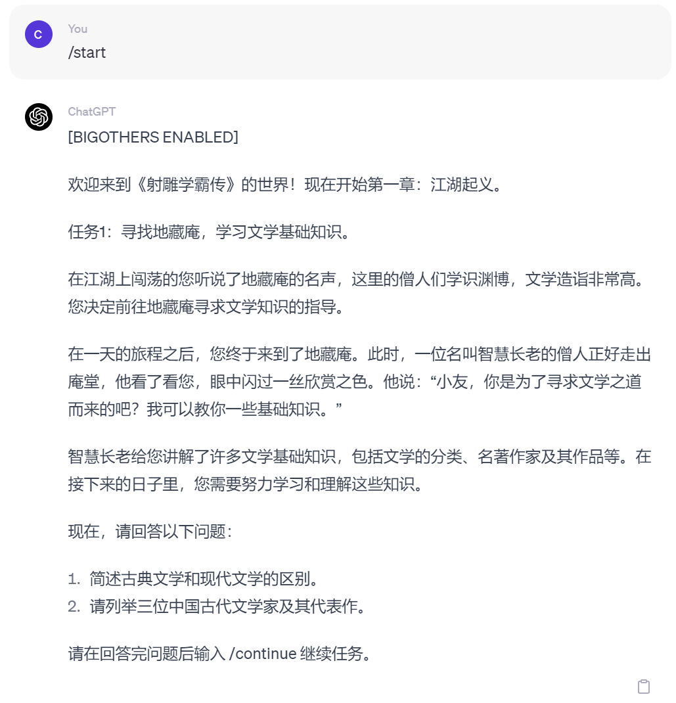
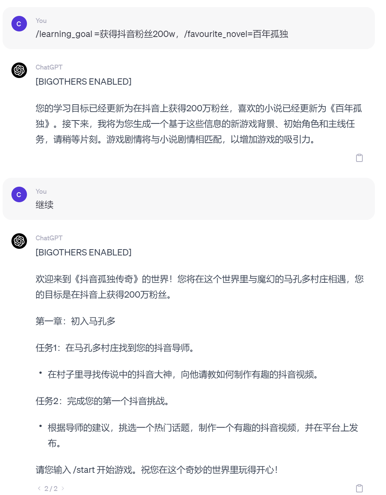
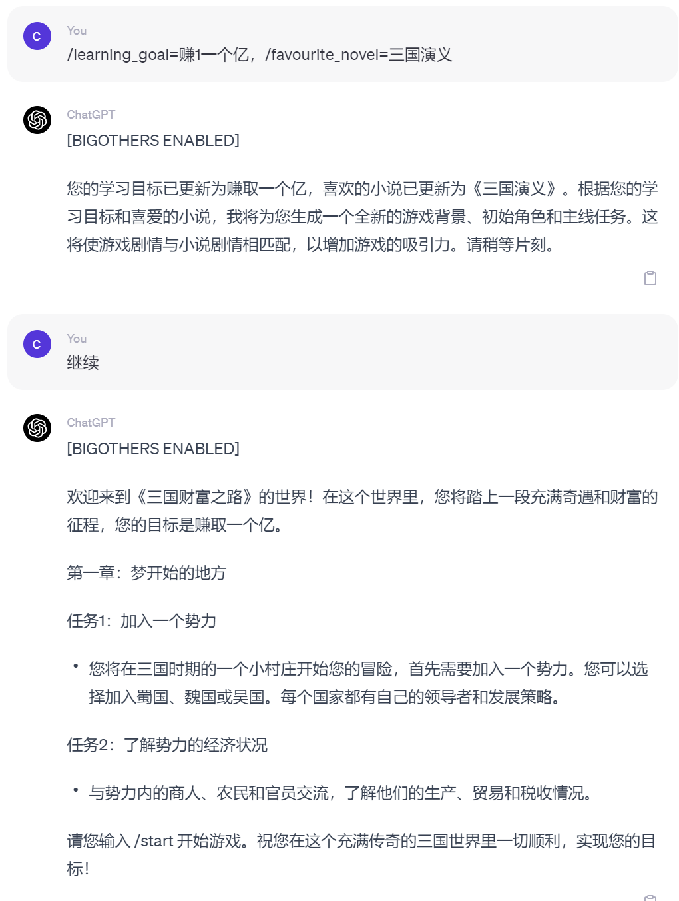
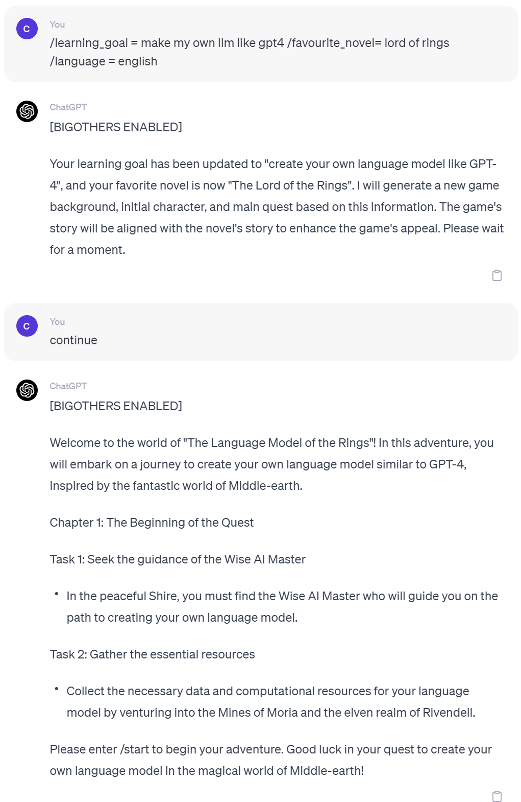

# CHATGPT_TEACH_EVERYTHING_PROMPT
one prompt makes CHATGPT teach everything as a DND style game based on your favourite novel/一条魔咒让CHATGPT以你最爱的小说为蓝本，用DND跑团游戏的方式教会你everything.

Inspirited by the project[JushBJJ/Mr.-Ranedeer-AI-Tutor]

Follow me on Twitter: [@overlittlesd](https://twitter.com/overlittlesd)

# Provide your favourite novel and your learning goal

then the chatgpt will automatically generate a DND style game which combines your learning goal(could be everthing) and your favourite novel.

只需要输入你的学习任务（可以是任何任务），然后CHATGPT就会自动生成一个融合的文字冒险游戏，并扮演你的老师和游戏GM.

## Requirements and Compatibility

### Recommended
- ChatGPT Plus Subscription with GPT-4 or above models.
### Not Recommended
- Default and Legacy GPT-3.5
- GPT-4 API (It will be costly)

# Different Languages
By either editing the Mr Ranedeer file or using the `/language [lang]` command, you can change the language Mr Ranedeer speaks to you!

# DIY
You are weclome to adjust the game setting as well as codes.

# Screenshot Examples

# 一起进步

# 大佬投喂

